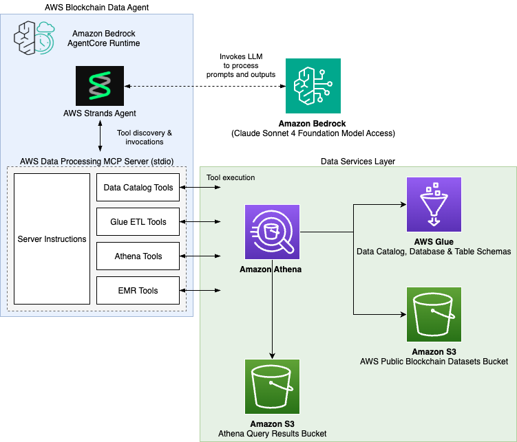
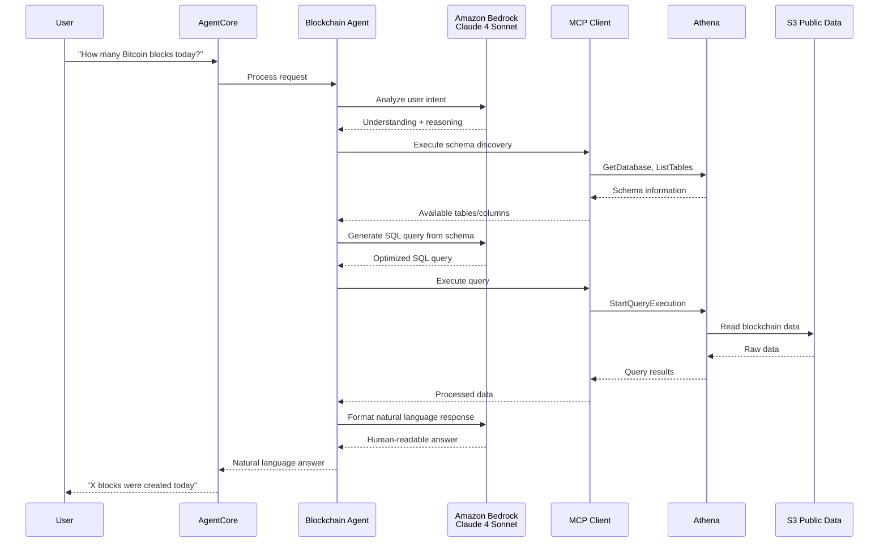

# Blockchain Data Processing Agent - Architecture Diagram

## System Architecture

## Data Flow

## Component Details

### Core Components
- **Amazon Bedrock AgentCore**: Serverless agent runtime platform
- **Blockchain Agent**: Claude Sonnet 4-powered agent with blockchain expertise
- **MCP Client**: Model Context Protocol client for AWS data processing tools

### AWS Services
- **Amazon Athena**: Serverless query engine for blockchain data analysis
- **AWS Glue**: Data catalog service for schema discovery
- **Amazon S3**: Storage for public blockchain datasets and query results
- **Amazon ECR**: Container registry for agent deployment
- **AWS CodeBuild**: Automated build pipeline for agent updates
- **CloudWatch**: Monitoring, logging, and observability

### Data Sources
- **Bitcoin (btc)**: Blocks, transactions, inputs, outputs
- **Ethereum (eth)**: Blocks, transactions, logs, contracts, traces
- **TON**: Account states, messages, transactions, NFT/Jetton events

### Security
- **IAM Role**: Least-privilege permissions for data access
- **Service-Linked Roles**: Automatic role creation for AgentCore services
- **Resource Scoping**: Permissions limited to specific S3 buckets and resources

## Trust Boundary Analysis

### Trust Zones and Components

| Trust Zone | Component | Trust Level | Description | Security Controls |
|------------|-----------|-------------|-------------|-------------------|
| **External** | User Input | ❌ Untrusted | User prompts and requests | Input validation, rate limiting, authentication |
| **AgentCore Runtime** | Blockchain Agent | ✅ High Trust | Claude Sonnet 4 agent process | Model guardrails, prompt injection protection |
| **AgentCore Runtime** | MCP Client | ✅ High Trust | Strands framework client | Input sanitization, structured communication |
| **AgentCore Runtime** | MCP Server | ⚠️ Medium Trust | AWS data processing server | Process isolation, query validation |
| **AWS Services** | Amazon Athena | ✅ Trusted | Query execution engine | IAM permissions, SQL injection prevention |
| **AWS Services** | AWS Glue | ✅ Trusted | Data catalog service | IAM permissions, resource scoping |
| **AWS Services** | S3 Public Data | ✅ Trusted | Blockchain datasets (read-only) | IAM permissions, bucket policies |
| **AWS Services** | S3 Query Results | ✅ Trusted | Query output storage | IAM permissions, encryption at rest |
| **Infrastructure** | IAM Role | 🔐 Security Context | AgentCoreDataProcessingRole | Least-privilege permissions |

### Trust Boundary Communications

| Purpose | Source Entity | Target Entity | Security Controls |
|---------|---------------|---------------|-------------------|
| User request processing | User | AgentCore | HTTPS/TLS encryption, authentication, input validation |
| Agent orchestration | AgentCore | Blockchain Agent | Process isolation, memory protection |
| LLM reasoning | Blockchain Agent | Amazon Bedrock Claude 4 | IAM authentication, API rate limiting, model guardrails |
| Tool invocation | Blockchain Agent | MCP Client | In-process communication, structured JSON-RPC |
| AWS service access | MCP Client | MCP Server | stdio pipes, process isolation, IPC security |
| Schema discovery | MCP Server | AWS Glue | IAM role authentication, least-privilege permissions |
| Query execution | MCP Server | Amazon Athena | IAM role authentication, query validation, SQL injection prevention |
| Data retrieval | Amazon Athena | S3 Public Data | Service-to-service authentication, bucket policies, read-only access |
| Result storage | Amazon Athena | S3 Query Results | Service-to-service authentication, encryption at rest, IAM permissions |

### Security Controls by Boundary

| Boundary | Entry Point | Security Controls | Risk Mitigation |
|----------|-------------|-------------------|-----------------|
| **External → AgentCore** | User prompts | • Input validation • Prompt injection detection • Rate limiting • Authentication | Malicious input, abuse |
| **Agent → MCP** | Tool calls | • Structured JSON-RPC • Parameter validation • Process isolation | Code injection, privilege escalation |
| **MCP → AWS** | API calls | • IAM role authentication • Least-privilege permissions • Query validation | Unauthorized access, data exfiltration |
| **AWS Internal** | Service calls | • Service-linked roles • VPC isolation • Encryption in transit/rest | Internal AWS threats |

### Trust Boundary Analysis

#### **External Boundary (Untrusted → Trusted)**
- **Entry Point**: User prompts via HTTPS/TLS to AgentCore
- **Security Controls**: 
  - Input validation and sanitization
  - Prompt injection detection and prevention
  - Rate limiting and authentication

#### **AgentCore Runtime Boundary (Trusted Environment)**
- **Agent Process (High Trust)**:
  - Runs user-provided prompts through Claude Sonnet 4
  - Implements business logic and query generation
  - Has full access to MCP client capabilities
  
- **MCP Server Process (Medium Trust)**:
  - Isolated process with limited scope
  - Only handles AWS API interactions
  - Cannot access agent memory or state directly

#### **Inter-Process Communication (IPC)**
- **Transport**: stdio pipes (stdin/stdout)
- **Security**: Process isolation, no network exposure
- **Data Flow**: Structured JSON-RPC messages only

#### **AWS Services Boundary (Trusted Infrastructure)**
- **Authentication**: IAM role-based access
- **Authorization**: Least-privilege permissions
- **Encryption**: TLS in transit, encryption at rest
- **Audit**: CloudTrail logging for all API calls

#### **Security Controls by Layer**

| Layer | Security Control | Purpose |
|-------|------------------|---------|
| **Input** | Prompt validation | Prevent injection attacks |
| **Agent** | Model guardrails | Prevent harmful outputs |
| **MCP** | Query validation | Prevent SQL injection |
| **AWS** | IAM permissions | Least-privilege access |
| **Data** | Resource scoping | Limit data access |
| **Audit** | CloudWatch logs | Security monitoring |

### Example Data Flow
1. User prompt: "How many Bitcoin blocks were mined today?"
2. AgentCore → Blockchain Agent processes request
3. Agent → Bedrock Claude 4 Sonnet: Analyze user intent and context
4. Bedrock returns understanding of blockchain query requirements
5. Agent → MCP Client: Discover btc database schema
6. MCP → Glue: Get table metadata for btc.blocks
7. Agent → Bedrock: Generate SQL query using schema and user intent
8. Bedrock returns optimized SQL: SELECT COUNT(*) FROM btc.blocks WHERE cast(date as date) = current_date
9. MCP → Athena: Execute query on S3 data
10. Athena → S3: Read Bitcoin blockchain data
11. Results passed back to MCP → Agent
12. Agent → Bedrock: Format natural language response from query results
13. Bedrock returns human-readable answer
14. User receives: "X blocks were mined today"